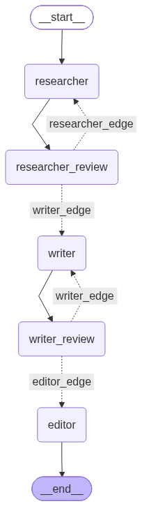

# Multi-Agent Blog Generator

A LangGraph-based blog workflow with three agents and human review checkpoints.

## Workflow



The graph follows this sequence:

1. The Research Agent creates a structured research outline for the topic and audience.
2. A human reviews the research and either approves it or sends feedback for revision.
3. The Writer Agent creates a blog draft from the approved research.
4. A human reviews the draft and either approves it or sends feedback for revision.
5. The Editor Agent produces the final polished blog post.

The workflow state is defined in `state.py`, the graph and review interrupts are defined in `graph.py`, and the prompts and Groq model setup are defined in `agents.py`.

## Setup

Create a virtual environment, activate it, and install the packages imported by the project:

```powershell
pip install langchain-groq langgraph pydantic python-dotenv jupyter
```

Create a `.env` file in the project root:

```env
GROQ_API_KEY=your_groq_api_key
```

The `.env` file is excluded by `.gitignore` and is loaded by `agents.py`.

## Run

Open the included notebook and run its cells:

```powershell
jupyter notebook blog_notebook.ipynb
```

When the graph pauses for a review, resume it with either an approval or feedback. The graph expects a response shaped like this:

```python
{"action": "approve"}
```

or:

```python
{"action": "revise", "feedback": "Describe the requested changes."}
```

## Project structure

```text
agents.py                       Groq LLM setup and Research, Writer, and Editor agents
graph.py                        LangGraph nodes, review routing, and checkpointed graph
state.py                        Shared BlogState model
blog_notebook.ipynb             Notebook for running the workflow
the_multi_agent_workflow.png    Workflow diagram
```
